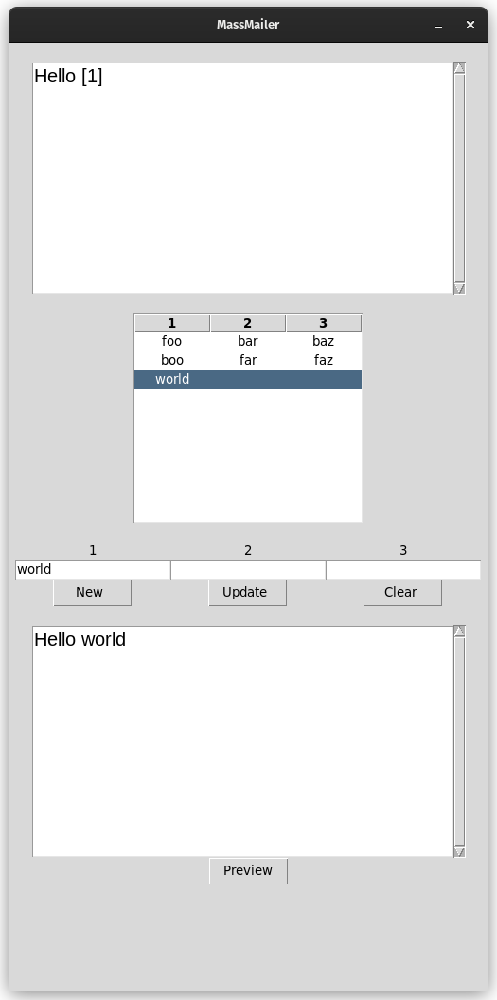

# MassMailer-sovellus
Sovelluksen avulla on mahdollista kirjoittaa muuttujia sisältäviä sähköposteja, määrittää muuttujille vastaanottajakohtaisia arvoja, sekä lähettää määritellyt arvot omaavia sähköposteja.

## Dokumentaatio
[Vaatimusmäärittely](https://github.com/nualn/ot-harjoitustyo/blob/main/dokumentaatio/vaatimusmaarittely.md)

[Tuntikirjanpito](https://github.com/nualn/ot-harjoitustyo/blob/main/dokumentaatio/tuntikirjanpito.md)

[Changelog](https://github.com/nualn/ot-harjoitustyo/blob/main/dokumentaatio/changelog.md)

[Arkkitehtuuri](https://github.com/nualn/ot-harjoitustyo/blob/main/dokumentaatio/arkkitehtuuri.md)

## Sovelluksen tila

Ensimmäinen versio sovelluiksen graafisesta käyttöliittymästä on käytössä. Käyttäjä pystyy määrittämään 3 muuttujaa, jotka voi sijoittaa viestikentään määriteltyyn viestiin valitsemalla halutun rivin taulukosta ja painamalla Preview-nappia. Sijoitus kohdat määritellään lisäämällä tekstiin sarakkeen nimi hakasulkujen sisällä, esim [1]. Sovellus lataa käynnistyessään 2 esimerkkiriviä.

Alla esimerkki toiminnasta:


## Ohjelman asennus ja käynnistys
1. Asenna riippuvuudet:
```bash
poetry install
```
2. Käynnistä sovellus:
```bash
poetry run invoke start
```

## Testaus
1. Aja testit
```bash
poetry run invoke test
```

2. Generoi testikattavuusraportti
```bash
poetry run invoke coverage-report
```
## Muut komennot
1. Aja lintteri
```bash
poetry run invoke lint
```
2. Autoformatoi koodi
```bash
poetry run invoke format
```
