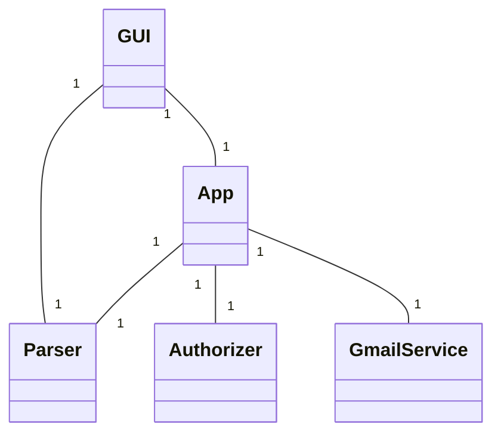
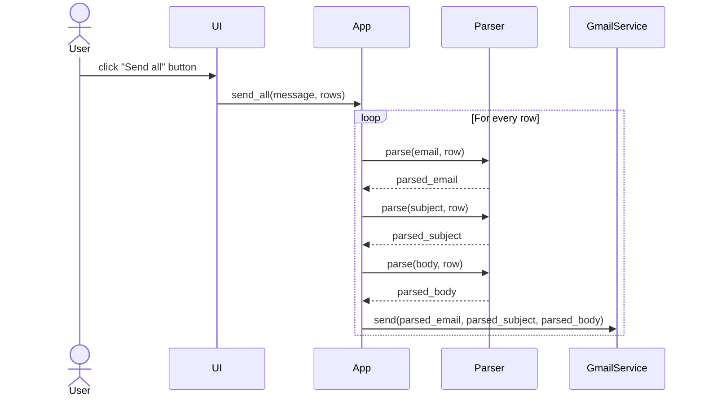

## Class diagram

```mermaid
classDiagram

GUI "1"--"1" Parser
GUI "1"--"1" App

App "1"--"1" Parser
App "1"--"1" Authorizer
App "1"--"1" GmailService

```

## Sequence diagram
### Sending emails

```mermaid
sequenceDiagram

actor User

User ->> UI: click "Send all" button
UI ->> App: send_all(message, rows)
loop For every row
  App ->> Parser: parse(email, row)
  Parser -->> App: parsed_email
  App ->> Parser: parse(subject, row)
  Parser -->> App: parsed_subject
  App ->> Parser: parse(body, row)
  Parser -->> App: parsed_body
  App ->> GmailService: send(parsed_email, parsed_subject, parsed_body)
end

```
