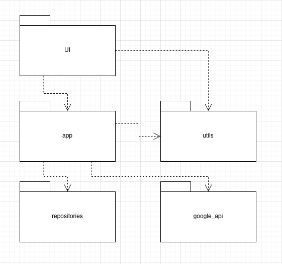
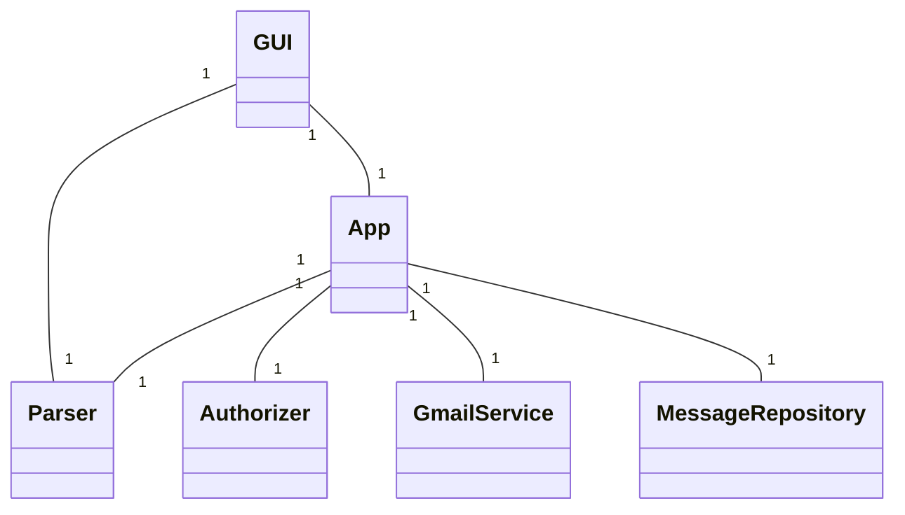
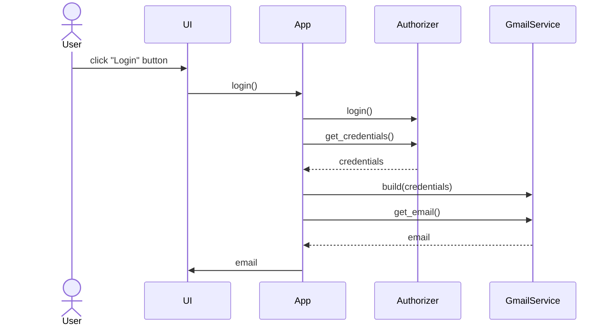
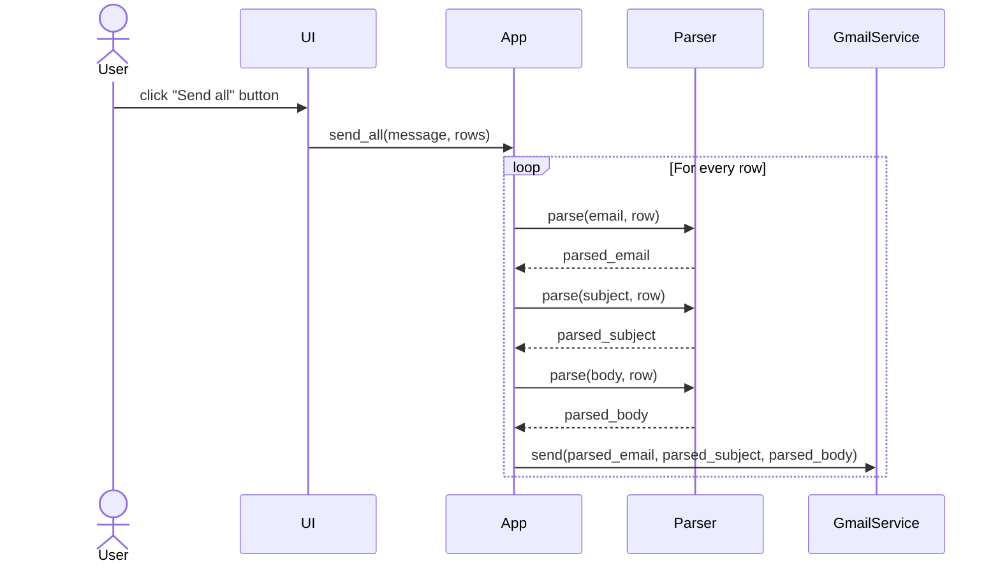
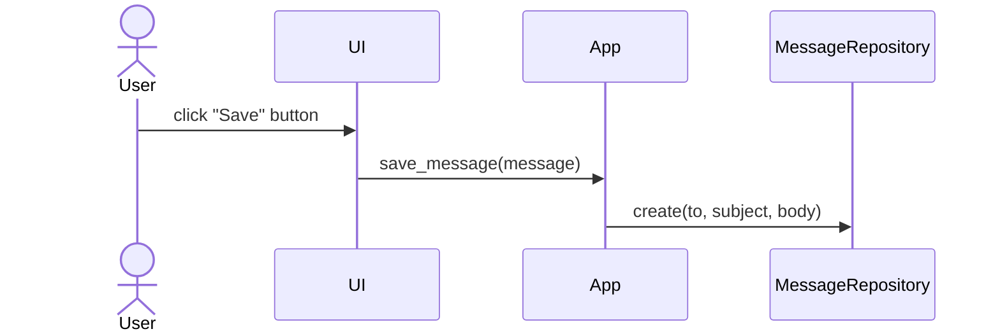
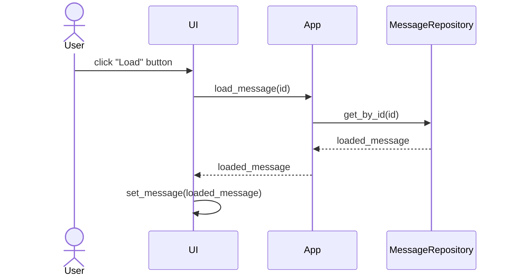
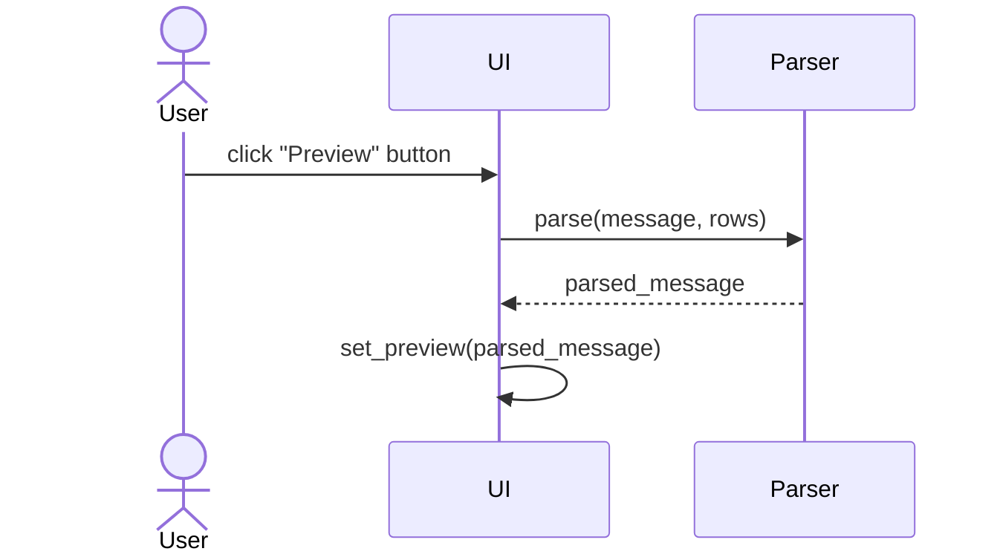

# Arkkitehtuurikuvaus

## Rakenne

## Pakkausrakenne

Ohjelman rakenne noudattaa pääosin kolmitasoista kerrosarkkitehtuuria. Koodin pakkausrakenne on seuraava:

Käyttöliittymästä vastaava koodi on pakkauksessa ui, sovelluslogiikasta vastaava koodi pakkauksessa app ja tietojen pysyväistallennuksesta vastaavan koodi pakkauksessa repositories. Pakkaus gmail_api sisältää luokat, jotka tarjoavat rajapinnan Gmail API:in käyttämiseen. Pakkaus utils sisältää apuluokkia, jotka tarjoavat apuja sovelluksen toiminnallisuuden toteuttamiseen.

## Käyttöliittymä

Sovelluksen käyttöliittymä sisältää vain yhden näkymän. Näkymä voidaan jakaa kolmeen pääosioon:
- Viestieditori
- Muuttujataulukko
- Esikatselu
Lisäksi käyttöliittymässä on "Login"- ja "Send all"-napit

## Sovelluslogiikka

Alla oleva luokkakaavio kuvaa sovelluksen luokkien suhteita toisiinsa.

App-luokka toimii sovelluksen kontrollerina. Se vastaa käyttöliittymän toiminnallisuuksien toteuttamisesta. App-luokka käyttää GmailService-luokkaa viestien lähettämiseen ja MessageRepository-luokkaa viestien tallentamiseen ja lataamiseen tietokannasta. App-luokka käyttää Authorizer-luokkaa käyttäjän autentikoimiseen ja Parser-luokkaa muuttujien viesteihin parsimiseen.

Myös käyttöliittymä käyttää Parser-luokkaa esikatseltavien viestien parsimiseen.

## Päätoiminnallisuudet

Tässä osiossa kuvataan sovelluksen päätoiminnallisuudet sekvenssikaavioiden avulla.

### Sisäänkirjautuminen

Sovelluksen käyttöliitymässä on Login-nappi, jota painamalla käyttäjä voi autentikoitua Gmail-tililleen. Riippuen siitä, onko sovelluksessa tallessa voimassaoleva Oauth-token, avataan selainikkuna, jossa käyttäjä voi kirjautua Gmail-tililleen tai sitten käyttäjä kirjataan suoraan sisään. Tämä toiminnallisuus vaatii sekä Googlen sovellus-id:n sisältävän 'credentials.json' tiedoston että sen, että käyttäjän sähköposti on lisätty Googlen Cloud Consoleen testaajien listalle.

### Sähköpostien lähetys

Käyttäjä voi lähettää massasähköposteja. Tämä toiminnallisuus vaatii, että käyttäjä on kirjautunut sisään.

### Viestien tallentaminen tietokantaan

Käyttäjä voi tallentaa viestin tietokantaan UI:n Save-nappulaa painamalla. Viereisestä valikosta voi myös valita tallennetaanko uusi viesti vai päivitetäänkö jo olemassa olevaa viestiä.

### Viestien lataaminen tietokannasta

Käyttäjä voi ladata viestin tietokannasta UI:n Load-nappulaa painamalla. Viereisestä valikosta voi valita, mikä viesti halutaan ladata.

### Viestin esikatselu

Käyttäjä voi esikatsella valitsemansa rivin muuttujat sisältävää viestiä UI:n Preview-nappulaa painamalla.

