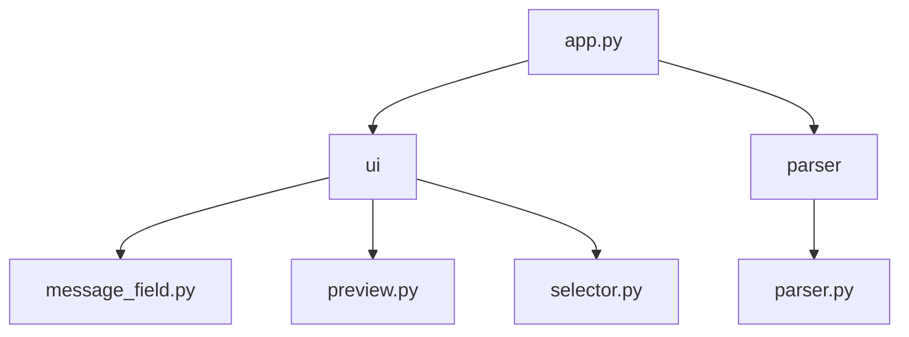

## Class diagram

## Folder diagram

## Päätoiminnallisuudet

Tässä osiossa kuvataan sovelluksen päätoiminnallisuudet sekvenssikaavioiden avulla.

### Sisäänkirjautuminen

Sovelluksen käyttöliitymässä on Login-nappi, jota painamalla käyttäjä voi autentikoitua Gmail-tililleen. Riippuen siitä, onko sovelluksessa tallessa voimassaoleva Oauth-token, avataan selainikkuna, jossa käyttäjä voi kirjautua Gmail-tililleen tai sitten käyttäjä kirjataan suoraan sisään. Tämä toiminnallisuus vaatii sekä Googlen sovellus-id:n sisältävän 'credentials.json' tiedoston että sen, että käyttäjän sähköposti on lisätty Googlen Cloud Consoleen testaajien listalle.

### Sähköpostien lähetys

Käyttäjä voi lähettää massasähköposteja. Tämä toiminnallisuus vaatii, että käyttäjä on kirjautunut sisään.

### Viestien tallentaminen tietokantaan

Käyttäjä voi tallentaa viestin tietokantaan UI:n Save-nappulaa painamalla. Viereisestä valikosta voi myös valita tallennetaanko uusi viesti vai päivitetäänkö jo olemassa olevaa viestiä.

### Viestien lataaminen tietokannasta

Käyttäjä voi ladata viestin tietokannasta UI:n Load-nappulaa painamalla. Viereisestä valikosta voi valita, mikä viesti halutaan ladata.

### Viestin esikatselu

Käyttäjä voi esikatsella valitsemansa rivin muuttujat sisältävää viestiä UI:n Preview-nappulaa painamalla.

