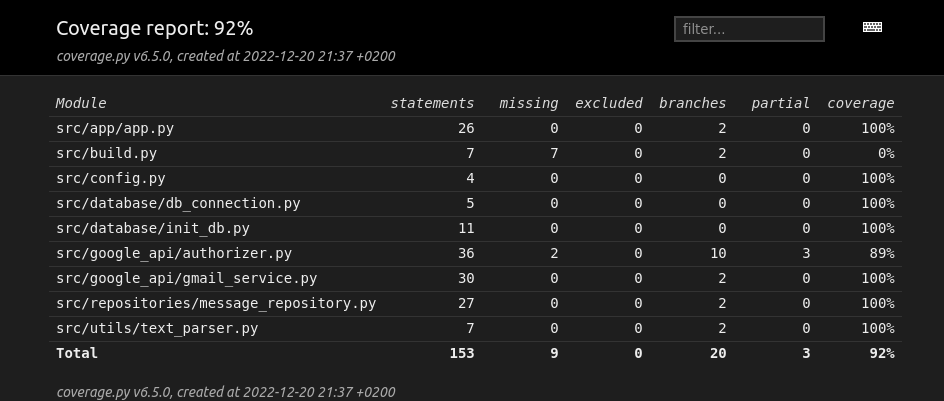

# Testausdokumentti
Sovellusta on testattu automaattisin yksikkö- ja integraatiotestein sekä järjestelmä tasolla manuaalisesti kokeilemalla toiminnallisuuksia.

## Yksikkö- ja integraatiotestaus
Sovelluksen yksikkö- ja integraatiotestauksessa on käytetty unittest-kirjastoa. 
Testiluokka ```TestParser``` testaa ```_Parser``` luokan toimintaa. ```TestMessageRepository``` testaa ```MessageRepository``` luokan toimintaa kirjoittamalla ja lukemalla dataa testitietokannasta.
```TestGmailService``` testaa ```GmailService``` luokan toimintaa mockaamalla Gmail API:n toiminnan.
```TestAuthorizer``` testaa ```Authorizer``` luokan toimintaa mockaamalla Google OAuth2.0 kirjastoa.
```TestApp``` testaa ```App``` luokan toimintaa. Se injektoi riippuvuuksiksi mockatut luokat ja testaa että sovellus toimii oikein.
```TestAppIntegration``` luokka testaa sovelluslogiikan toimintaa kokonaisuudessaan. Se injektoi riippuvuuksiksi mockatut Googlen kirjastot ja testaa että App luokan metodikutsut johtavat oikeisiin toimintoihin myös muissa luokissa.

## Testikattavuus
Sovelluksen testauksen haarautumakattavuus on 92%. Tähän ei ole laskettu käyttöliittymäkoodia. Testaamatta jää osa ```Authorizer```-luokan ```login```-metodista ja *build.py*-tiedosto, joka alustaa sovelluksen tietokannan.

## Järjestelmätestaus
Järjestelmätestaus on toteutettu manuaalisesti kokeilemalla vaatimusmäärittely-dokumentissa esitettyjä toiminnallisuuksia Linux-laitteella. 

## Sovellukseen jääneet laatuongelmat
Sovellus ei tällä hetkellä anna virheilmoituksia käyttäjälle, vaikka jotkin toiminnot epäonnistuisivat. Esimerkkejä:
* Jos käyttäjä yrittää kirjautua sisään, mutta Google ei anna sovellukselle oikeuksia käyttäjän sähköpostiin, ei sovellus ilmoita käyttäjälle mitään. 
* Jos käyttäjä yrittää lähettää sähköpostin kirjautumatta ensin sisään, ei sovellus ilmoita käyttäjälle mitään.
* Jos sähköpostin lähettäminen epäonnistuu, ei sovellus ilmoita käyttäjälle mitään.

Tämä ongelma on korjattavissa lisäämällä virheiden käsittelyä sovelluksen koodiin sekä virheilmoituksia käyttöliittymään.