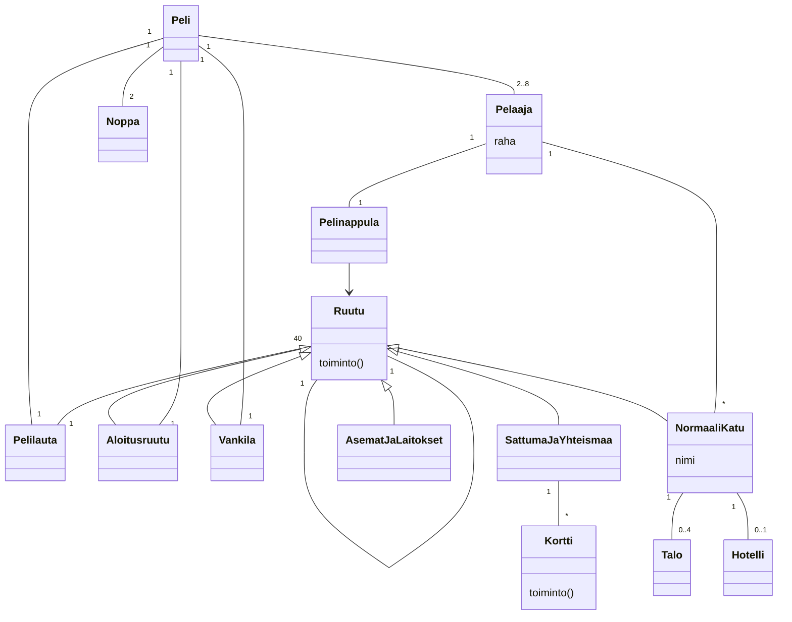

```mermaid
 classDiagram
      Peli "1"--"2..8" Pelaaja
      Peli "1"--"2" Noppa
      Peli "1"--"1" Pelilauta
      Ruutu "40" -- "1" Pelilauta
      Ruutu "1"--"1" Ruutu
      Pelaaja "1"--"1" Pelinappula
      Pelinappula --> Ruutu
      Ruutu <|-- Aloitusruutu
      Ruutu <|-- Vankila
      Ruutu <|-- SattumaJaYhteismaa
      Ruutu <|-- AsematJaLaitokset
      Ruutu <|-- NormaaliKatu
      SattumaJaYhteismaa "1"--"*" Kortti
      Pelaaja "1"--"*" NormaaliKatu
      NormaaliKatu "1"--"0..4" Talo
      NormaaliKatu "1"--"0..1" Hotelli
      Peli "1"--"1" Vankila
      Peli "1"--"1" Aloitusruutu

      Class Peli
      Class Noppa
      class Pelaaja{
        raha
      }
      class Pelilauta
      class Ruutu{
        toiminto()
      }
      Class Pelinappula
      class Aloitusruutu
      class Vankila
      class SattumaJaYhteismaa
      class AsematJaLaitokset
      class NormaaliKatu{
        nimi
      }
      class Kortti{
        toiminto()
      }
```
