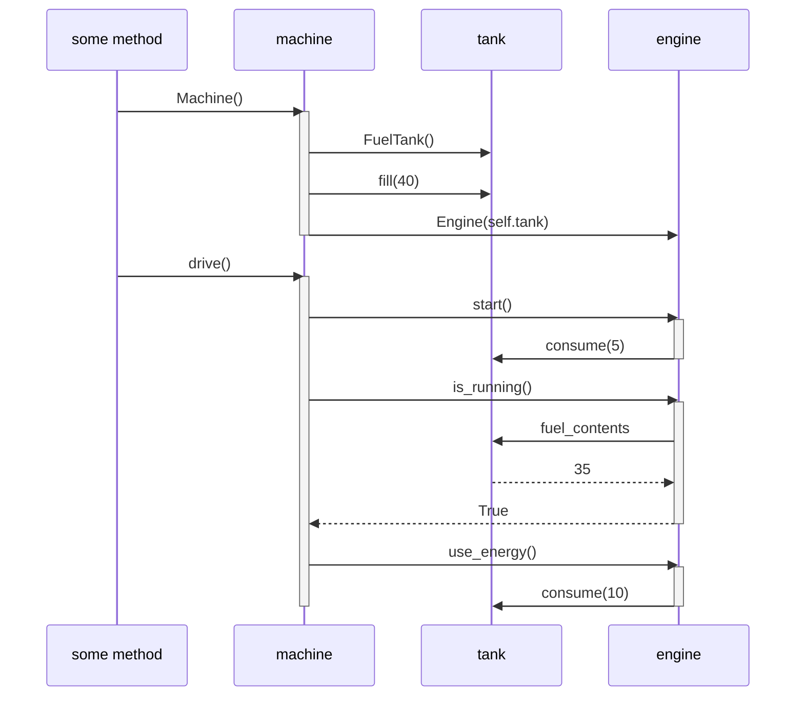

```mermaid
  sequenceDiagram
      some method->>machine: Machine()
      activate machine
      machine ->> tank: FuelTank()
      machine ->> tank: fill(40)
      machine ->> engine: Engine(self.tank)
      deactivate machine
      some method ->> machine: drive()
      activate machine
      machine ->> engine: start()
      activate engine
      engine ->> tank: consume(5)
      deactivate engine
      machine ->> engine: is_running()
      activate engine
      engine ->> tank: fuel_contents
      tank -->> engine: 35
      engine -->> machine: True
      deactivate engine
      machine ->> engine: use_energy()
      activate engine
      engine ->> tank: consume(10)
      deactivate engine
      deactivate machine
```
